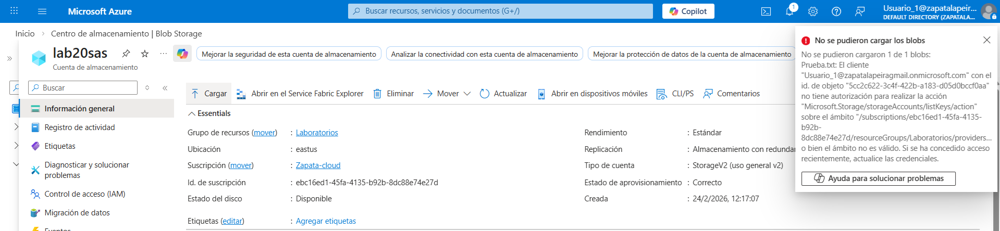
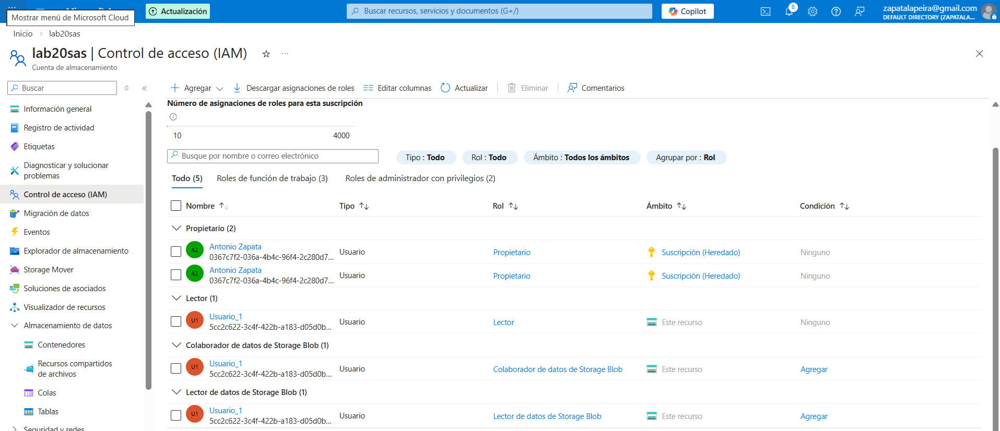
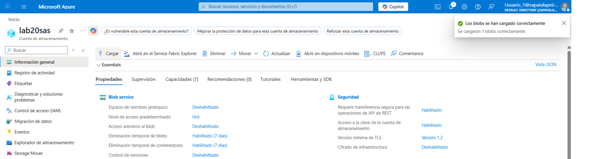

# Lab 29 – Incidencia: Permisos insuficientes en Storage (RBAC)

## Objetivo
Reproducir una incidencia habitual en Azure Storage: un usuario puede autenticarse, pero no puede subir archivos porque no tiene permisos de datos sobre el contenedor o sobre la cuenta de almacenamiento.

## Qué ha pasado (incidencia)
El usuario intentaba cargar un archivo en un contenedor de blobs, pero Azure devolvía un error de permisos. El problema no estaba en la conectividad ni en la autenticación, sino en la falta de un rol adecuado para operar sobre los datos.

## Resolución
He identificado que el usuario no tenía permisos de datos sobre Blob Storage. Para resolverlo, le he asignado el rol **Blob Data Contributor** y he validado después que la carga del archivo funciona correctamente.

## Evidencias

### 01 – Error al intentar subir el archivo

Se muestra el error de permisos al intentar cargar un blob sin el rol de datos adecuado.

---

### 02 – Rol Blob Data Contributor asignado

Se muestra la asignación del rol que permite escribir datos en Blob Storage.

---

### 03 – Carga realizada correctamente

Se muestra la validación final tras corregir RBAC: el archivo se carga correctamente en el contenedor.

## Qué diría en entrevista
“En Azure Storage no basta con tener acceso al recurso: también hacen falta permisos de datos. Si un usuario no puede subir archivos, reviso primero RBAC de plano de datos y, si corresponde, asigno Blob Data Contributor en el ámbito mínimo necesario.”
